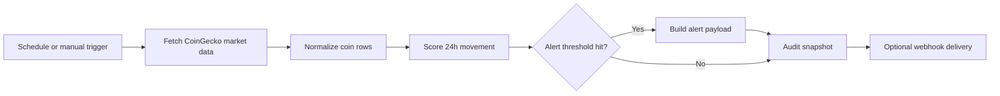

# n8n Crypto Alert Pipeline

[](https://github.com/Dshavidan/n8n-crypto-alert-pipeline/actions/workflows/validate.yml)

An automation-first market monitoring project that uses n8n to fetch crypto prices, score 24-hour volatility, and prepare actionable alert payloads for webhook, Telegram, Slack, or email delivery.

This repository is designed as a portfolio project: it includes an importable n8n workflow, Docker-based local setup, documented architecture, example payloads, and CI validation for the workflow artifacts.

## Business Problem

Crypto markets move continuously, but most manual checks are inconsistent and reactive. This workflow creates a lightweight early-warning pipeline that can run every 15 minutes, detect unusually large moves, and send structured alerts that are easy to route into an operations or trading-notification channel.

The goal is not to predict prices. The goal is to automate monitoring, reduce manual checks, and create a clean event trail for later analysis.

## What This Project Shows

- Workflow automation with n8n and Docker
- Public API ingestion from CoinGecko
- Rule-based volatility scoring with configurable watchlist thresholds
- Alert payload design for downstream tools
- Reproducible local setup and importable workflow export
- CI checks for JSON structure, workflow connections, and sample signal logic

## Architecture



## Workflow Logic

1. Trigger the workflow manually or on a 15-minute schedule.
2. Fetch current prices and 24-hour percentage changes for the configured coins.
3. Normalize API response data into one row per asset.
4. Score each coin as `normal`, `warning`, or `critical`.
5. Build a structured alert payload when any threshold is exceeded.
6. Optionally send the payload to a webhook-based channel.
7. Keep an audit snapshot of each execution for debugging and future analytics.

## Repository Structure

```text
.
├── .github/workflows/validate.yml
├── config/watchlist.example.json
├── docs/
│   ├── architecture.md
│   ├── sample-market-response.json
│   ├── sample-output.json
│   └── setup-guide.md
├── scripts/
│   ├── simulate_signal_engine.py
│   └── validate_project.py
├── workflows/crypto-alert-pipeline.json
├── .env.example
├── docker-compose.yml
└── README.md
```

## Quick Start

```bash
cp .env.example .env
docker compose up -d
```

Open n8n at `http://localhost:5678`, create your owner account, then import:

```text
workflows/crypto-alert-pipeline.json
```

Run the workflow manually first. After the output looks good, activate the schedule trigger.

## Configuration

Edit `config/watchlist.example.json` to adjust the portfolio watchlist and severity thresholds.

```json
{
  "currency": "usd",
  "coins": [
    {
      "id": "bitcoin",
      "symbol": "BTC",
      "warning_abs_pct": 3.0,
      "critical_abs_pct": 6.0
    }
  ]
}
```

The n8n workflow currently watches Bitcoin, Ethereum, and Solana. Update the `Fetch Market Data` HTTP node and the `Normalize and Score` code node when changing the production watchlist.

## Local Validation

```bash
python scripts/validate_project.py
python scripts/simulate_signal_engine.py \
  --config config/watchlist.example.json \
  --input docs/sample-market-response.json
```

The validation script checks that:

- JSON artifacts are valid
- n8n node names are unique
- workflow connections point to existing nodes
- required workflow stages are present
- the sample market response produces a valid alert summary

## Example Alert Payload

```json
{
  "generated_at": "2026-10-07T09:15:00Z",
  "alert_count": 2,
  "highest_severity": "critical",
  "alerts": [
    {
      "symbol": "BTC",
      "price": 67234.12,
      "change_24h_pct": -6.42,
      "severity": "critical",
      "direction": "down"
    }
  ]
}
```

See the full example in `docs/sample-output.json`.

## Portfolio Notes

This project is intentionally small but production-shaped. It demonstrates how I think about automation projects: clear trigger, API contract, transformation logic, alert routing, documentation, and validation instead of just a screenshot of a workflow.

## Next Improvements

- Add a Telegram or Slack credential path with screenshots
- Persist audit records to Google Sheets, Postgres, or BigQuery
- Add a Streamlit dashboard for historical alerts
- Add a TradingView webhook trigger for strategy-based alerts
- Add rate-limit handling for paid CoinGecko API keys
