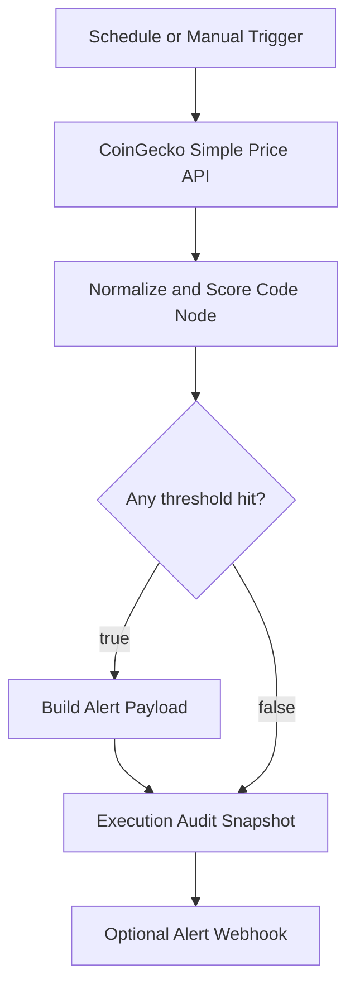

# Architecture

This project is a small but production-shaped automation pipeline. It separates data ingestion, signal scoring, alert payload construction, and delivery so each part can be inspected independently.

## High-Level Flow

## Design Decisions

| Area | Choice | Reason |
| --- | --- | --- |
| Orchestration | n8n | Fast visual workflow iteration and easy connector expansion |
| Market data | CoinGecko simple price endpoint | Public API, simple response shape, good for a portfolio MVP |
| Signal logic | Absolute 24-hour percentage movement | Easy to explain and tune per asset |
| Output | Structured JSON payload | Can be routed to Slack, Telegram, email, or a storage target |
| Validation | Python stdlib script | Keeps CI lightweight and dependency-free |

## Signal Model

Each asset is scored by absolute 24-hour percentage movement:

- `normal`: below warning threshold
- `warning`: above warning threshold
- `critical`: above critical threshold

The thresholds are intentionally different per asset because volatility expectations differ between Bitcoin, Ethereum, and Solana.

## Failure Modes

- API response missing one asset: the scoring step marks that asset with `missing_price`.
- Webhook not configured: the workflow can still be tested through manual execution output.
- API rate limit: production usage should add retry/backoff and paid API key handling.
- Alert fatigue: thresholds should be tuned using historical alert counts before production use.

## Production Extension Ideas

- Store audit rows in Postgres or BigQuery
- Add deduplication so repeated alerts are not sent every 15 minutes
- Add historical volatility baselines instead of fixed thresholds
- Add alert routing by severity
- Add a small dashboard for alert history and market snapshots
